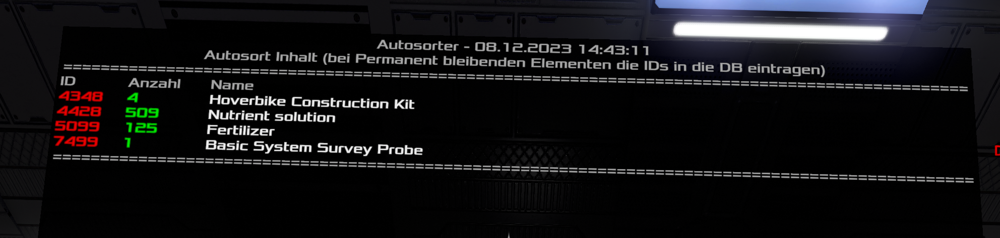
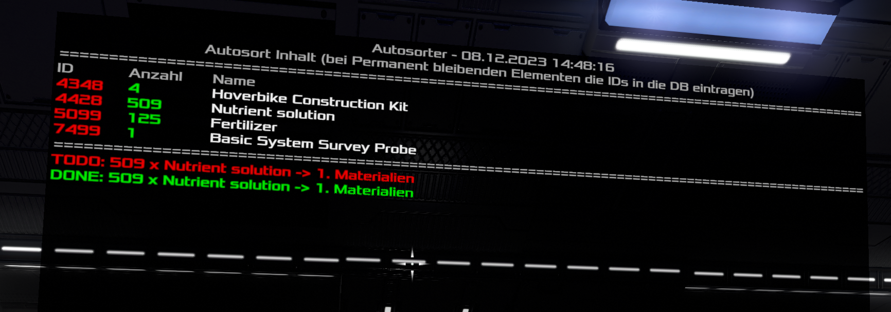

### Bilder + Anleitung:

- Es werden auf der Ausgabe alle Items im Input Container angezeigt, die noch nicht zugeordnet sind.
- IDs müssen dann in dem [[#DB LCD]] dem gewünschten Container zugeordnet werden.
- Wenn ein Item zugeordnet ist, folgt eine entsprechende Ausgabe unter dem zweiten Trennstrich:
	- Grün: Erfolgreich verschoben (Diese Anzeige verschwindet nach ein paar Sekunden.)
	- Bleibt Rot: Container Nicht gefunden, oder Container gerade gesperrt. auch wenn z.B. von einem anderen Spieler gerade auf den Zielcontainer zugegriffen wird, bleibt die Anzeige Rot.



#### Benötigte Bauteile:
- 1x Container (Input)
- 3x LCD (Script, Datenbank, Anzeige)
#### Container-Namen:
- Input (Nur hier werden Items entnommen!): `_AUTOSORT_IN`
	- Kann im Script angepasst werden (Zeile 2.)
#### LCD-Namen:
- Script-LCD: `Script:Autosort*`
- DB-LCD: `DB_AUTOSORT`
- Ausgabe-LCD: `AutosortOutput`
#### Ausgabe-LCD:
- Optimiert auf Projektor mit Breite = 3, Höhe egal.
#### DB LCD:
- Mindestens ein Element mit "ContainerName" & "ItemIds" muss vorhanden sein.
- Das Format muss JSON kompatibel sein. (Siehe Beispiel unten)
- Elemente:
    - ContainerName ist der Name des Containers
    - ItemIds ist eine Kommagetrennte Liste an IDs die in den Container einsortiert werden sollen.
    - Lists ist der Name der Liste, die zusätzlich in den Container sortiert werden soll.
    - Die ItemIds haben Vorrang vor den Listen, soll also etwas aus einer Liste in einen anderen Container einsortiert werden, kann die ID auch einfach in der ItemId Liste eingetragen werden.
- Bei Item-Listen über 2000 Zeichen muss das JSON komprimiert werden, damit es auf den LCD passt. hierfür gibt es tools wie z.B: https://jsonformatter.org/json-minify
	- Beispiel der Fehlermeldung bei einem zu langen Datenbankeintrag:

#### Inhalt DB-LCD:
```json
[
	{
		"ContainerName": "1. Materialien",
		"ItemIds": "2247,4316,4360,4361,5104,5913,5914,5920,5921,5923,5927,7301,7312",
		"Lists": "Ingot,Components,EdenComponents"
	},
	{
		"ContainerName": "_AMMO_SCHIFF",
		"ItemIds": "4150,4152,4262,4263,4267,5719,5849"
	}
]
```

#### Script
1. das folgende Script ist komprimiert und kann direkt auf dem LCD eingefügt werden.
    - Falls sich jemand das Script anschauen möchte, ist dieses mit besser Lesbarer Formatierung in main.hbs zu finden.
```handlebars
<align=center>Autosorter - {{datetime}}</align>
{{~set 'SOURCE' '_AUTOSORT_IN'}}
{{~set 'DBLCDNAME' 'DB_AUTOSORT'}}
{{~set 'SEPARATOR' '<align=center>================================================================================================</align>'}}
<align=center>Autosort Inhalt (bei Permanent bleibenden Elementen die IDs in die DB eintragen)</align>
{{@root.Data.SEPARATOR}}
ID<pos=4em></pos><pos=5em>Anzahl</pos><pos=11em>Name</pos>
{{#items @root.E.S @root.Data.SOURCE}}
<color=red>{{Id}}</color><pos=4em></pos><pos=5em><color=green>{{Count}}</color></pos><pos=11em><color=white>{{i18n Id}}</color></pos>
{{/items}}
{{@root.Data.SEPARATOR}}
{{devices @root.E.S @root.Data.DBLCDNAME}}
{{gettext .0}}
{{#fromjson .}}
{{#each .}}
{{#jsontodictionary .}}
{{#items @root.E.S @root.Data.SOURCE}}
{{#test Id in ../ItemIds}}
<color=red>TODO: {{../Count}} x {{i18n ../Id}} -> {{../../ContainerName}}</color>
{{#move ../. @root.E.S ../../ContainerName}}
<color=green>DONE: {{../../Count}} x {{i18n ../../Id}} -> {{../../../ContainerName}}</color>
{{/move}}
{{/test}}
{{/items}}
{{split Lists ','}}
{{~#each .}}
{{#items @root.E.S @root.Data.SOURCE}}
{{#test Id in (lookup @root.ids ../.)}}
<color=red>[LISTS]TODO: {{../Count}} x {{i18n ../Id}} -> {{../../../../ContainerName}}</color>
{{#move ../. @root.E.S ../../../../ContainerName}}
<color=green>[LISTS]DONE: {{../../Count}} x {{i18n ../../Id}} -> {{../../../../../ContainerName}}</color>
{{/move}}
{{/test}}
{{/items}}
{{/each}}
{{/split}}
{{/jsontodictionary}}
{{/each}}
{{/fromjson}}
{{/gettext}}
{{/devices}}
```